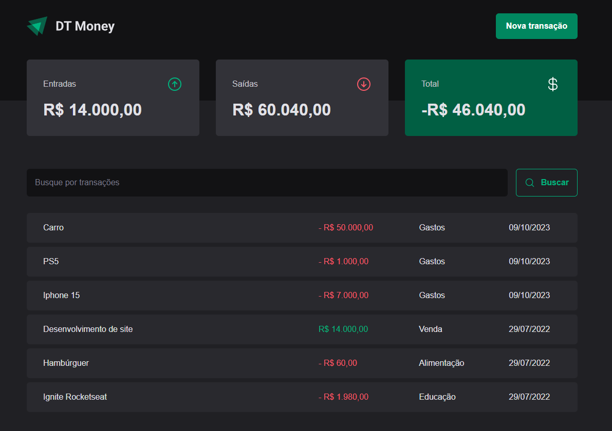

# DT-Money

## Overview

DT Money is a financial tracking application designed to help users manage their expenses efficiently. Users can add various transactions, categorizing them as income or outcome, and the application provides a summarized total, showcasing your financial status at a glance.



## Features

- **Transaction Input**: Add new transactions, specifying the type (income/outcome), amount, and category.
- **Financial Summary**: View a summarized total of your financial transactions, including total income, total outcome, and the balance.
- **Transaction History**: Review and manage your past transactions in a structured list.

## Technologies Used

- **React.js**: For building the user interface.
- **Styled Components**: For styling the components.
- **TypeScript**: To utilize static type-checking along with the latest ECMAScript features.
- **Zod** and **React-hook-form**: For form validation.
- **JSON Server**: To create a fake online REST server.
- **Axios**: For making API calls.
- **Phosphor-react**: For using icons throughout the application.
- **Scheduler** and **useContextSelector**: For optimizing performance.
- **useMemo**, **useContext**, and **useCallback**: For further performance optimization.
- **Radix-UI**: For implementing modals.
- **ESLint**: To enforce a consistent coding style and identify issues in the code.

## Getting Started

### Prerequisites

- Node.js
- npm or Yarn

### Installation

1. Clone the repository:

```
git clone https://github.com/samueloh99/dt-money.git
```

2. Navigate to the project directory:

```
cd dt-money
```

2. Install NPM packages:

```
npm install
or
yarn install
```

3. Start the development server:

```
npm dev
or
yarn dev
```

## Usage

1. **Add a New Transaction**: Specify the type (income/outcome), amount, and category..
2. **View Summary**: Check your financial summary at the top of the application.
3. **Review Transactions**: Scroll through your transaction or search on search bar history to review your past entries.

## Design

The design of the application is available on Figma. You can view it [here](<https://www.figma.com/file/sJWUVuIyZvPdyzZFie2TU3/DT-Money-(Community)?type=design&node-id=0-1&mode=design&t=OhEUOVwrBtSLILKX-0>).

## Contributing

Contributions are what make the open-source community such an amazing place to learn, inspire, and create. Any contributions you make are **greatly appreciated**.

1. Fork the Project
2. Create your Feature Branch (`git checkout -b feature/AmazingFeature`)
3. Commit your Changes (`git commit -m 'Add some AmazingFeature'`)
4. Push to the Branch (`git push origin feature/AmazingFeature`)
5. Open a Pull Request

## License

Distributed under the MIT License. See `LICENSE` for more information.

## Contact

Samuel Oh - [samueloh99@gmail.com](mailto:samueloh99@gmail.com)

Project Link: [https://github.com/samueloh99/dt-money](https://github.com/samueloh99/ignite-timer)

Live Project Link: https://vercel.com/samueloh9/dt-money
obs: You will not be able to add or see any expenses track on live link because I'm using JSON Server. So if you want to use it and test please clone and use it in your local environment.
